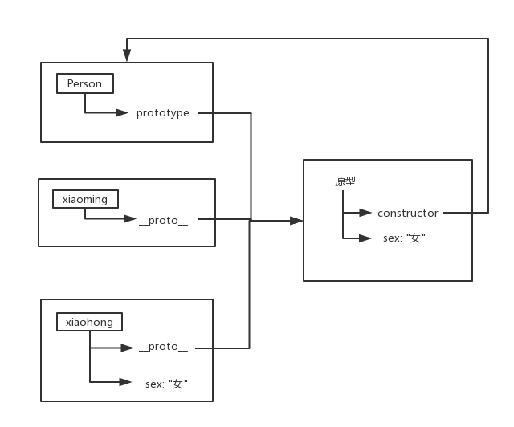

# 第一话 原型

在面向对象的编程中，有一句话叫一切皆对象。

如何描述对象之间的关系，成为了各种面向对象语言要面临的问题。

ECMAScript 为了弥补先天的缺憾，使用原型来描述对象之前的关系，在ES6中，还派生出了 class(类)、extends(继承)等概念。

ECMAScript所做的这些努力，让对象之间的关系更加清楚。但是这一切的基础都是基于原型这一基础，深入理解原型才能够让我们灵活使用各种ES6的语法，了解这些对象的行为及原理。

## 构造函数 Pserson 与 实例 xiaoming

首先我们来搞一个函数

```js
var Person = function () {

}
```

我们来看下这个Person都有些啥属性

``` js
Person.prototype  instanceof Object // true

```
Person 有一个 prototype 属性, 指向了一个对象。这个对象是干啥用的呢？ 先不要着急，我们先把这个函数，当做构造函数，new一个实例出来。

``` js
var xiaoming = new Person()

```
xiaoming 有哪些属性呢？ 

```js
xiaoming.__proto__ === Person.prototype // true

```


 **原型:** Person  和 xiaoming 各有两个属性，指向了同一个对象，也就是 xiaoming 的 【原型】。

### 番外1： 

```js
var xiaohong = new Pserson()
xiaohong.__proto__ === xiaoming.__proto__  // true

```
不管多少个实例，共享同一个原型

## 构造函数 Person 与 原型 


上面我们说到， 构造函数 Person 有一个 prototype属性， 指向了xiaoming的原型。

相反的呢，原型上有一个 constructor 属性，指向了 构造函数 Person

```js
Person.prototype.constructor === Person
```
## 实例 xiaoming 与 原型


我们来给Person增加一个性别属性sex

```js
Person.prototype.sex = "男"
xiaoming.sex // "男"
```

👌 我们可以发现~ 我们并没有给xiaoming 设置性别，然而xiaoming.sex 还是输出了 sex 。 

划重点： 我们读取实例属性的过程中，如果没有该属性，会沿着原型链，一直找到最顶层为止。

好的，前面番外1中我们提到，所有的属性共享同一个原型，所以

```js
xiaohong.sex // "男"
```
😂 xiaohong说我是个吕孩子，👌

```js
xiaohong.sex = "女"

xiaohong.sex // "女"
```


## 判断原型的方法

```js

xiaoming instanceof Person // true

xiaoming.__proto__ === Person.prototype

xiaoming.constructor === Person

// 注释： 对于 xiaoming.constructor === Person ， xiaoming 并没有 constructor 属性，然鹅，找到了xiaoming 原型上的 constructor, 原型的 constructor 指向了 Person 👌 

```

## instanceof 原理


> instanceof 运算符用来检测 constructor(A).prototype 是否存在于参数 object(a) 的原型链上。

```js 
function instance_of(L, R) {//L 表示左表达式，R 表示右表达式
 var O = R.prototype;// 取 R 的显示原型
 L = L.__proto__;// 取 L 的隐式原型
 while (true) { 
   if (L === null) 
     return false; 
   if (O === L)// 这里重点：当 O 严格等于 L 时，返回 true 
     return true; 
   L = L.__proto__; 
 } 
}
```

其实是判断的是 xiaoming 的 ```__proto__``` 与 ```Person.prototype```是否向相等

